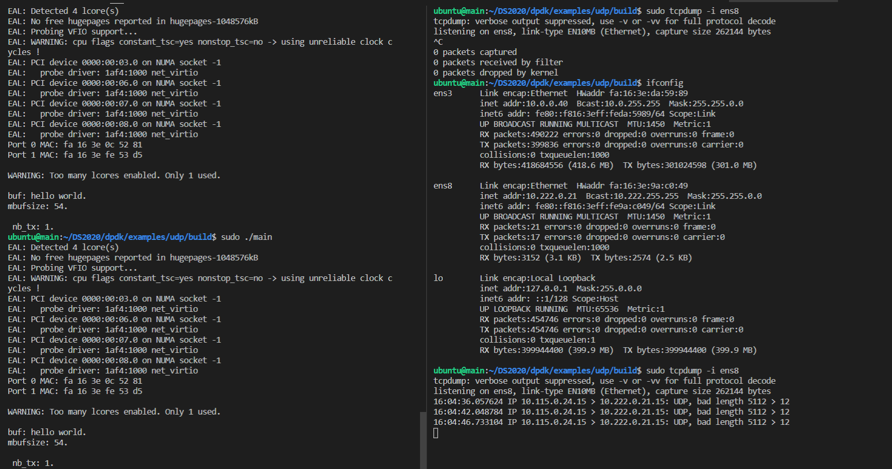

# Lab2 -- dpdk

## Part1

Q1: What’s the purpose of using hugepage?

A1: By using hugepage, it will take less items in TLB and raise the rate of both TLB hit and cache hit.


Q2: Take examples/helloworld as an example, describe the execution flow of DPDK programs? 

A2:  

- Initialize the basic operating environment via function `rte_eal_init`.

- Start up `lcore_hello` on every slave lcore via 

  ```cpp
  RTE_LCORE_FOREACH_SLAVE(lcore_id) {
      rte_eal_remote_launch(lcore_hello, NULL, lcore_id);
  }
  ```

- Run the `lcore_hello` function on each core.


Q3: Read the codes of examples/skeleton, describe DPDK APIs related to sending and receiving packets.

A3: 

- The data sending and receiving cycle is very simple. The burst sending and receiving functions are defined for high-speed message entry and exit as follows. 
  
- ```cpp
  static inline uint16_t rte_eth_rx_burst(uint8_t port_id, uint16_t queue_id, struct rte_mbuf **rx_pkts, const uint16_t nb_pkts)
  static inline uint16_t rte_eth_tx_burst(uint8_t port_id, uint16_t queue_id, struct rte_mbuf **tx_pkts, uint16_t nb_pkts)
  ```

- They are based on the port queues. The meaning of the four parameters is very intuitive: port, queue, message buffer, and number of sent and received packets.


Q4: Describe the data structure of ‘rte_mbuf’.

A4: 

```cpp
/**
 * The generic rte_mbuf, containing a packet mbuf.
 */
struct rte_mbuf {
	MARKER cacheline0;

	void *buf_addr;           /**< Virtual address of segment buffer. */
	phys_addr_t buf_physaddr; /**< Physical address of segment buffer. */

	uint16_t buf_len;         /**< Length of segment buffer. */

	/* next 6 bytes are initialised on RX descriptor rearm */
	MARKER8 rearm_data;
	uint16_t data_off;

	/**
	 * 16-bit Reference counter.
	 * It should only be accessed using the following functions:
	 * rte_mbuf_refcnt_update(), rte_mbuf_refcnt_read(), and
	 * rte_mbuf_refcnt_set(). The functionality of these functions (atomic,
	 * or non-atomic) is controlled by the CONFIG_RTE_MBUF_REFCNT_ATOMIC
	 * config option.
	 */
	RTE_STD_C11
	union {
		rte_atomic16_t refcnt_atomic; /**< Atomically accessed refcnt */
		uint16_t refcnt;              /**< Non-atomically accessed refcnt */
	};
	uint8_t nb_segs;          /**< Number of segments. */
	uint8_t port;             /**< Input port. */

	uint64_t ol_flags;        /**< Offload features. */

	/* remaining bytes are set on RX when pulling packet from descriptor */
	MARKER rx_descriptor_fields1;

	/*
	 * The packet type, which is the combination of outer/inner L2, L3, L4
	 * and tunnel types. The packet_type is about data really present in the
	 * mbuf. Example: if vlan stripping is enabled, a received vlan packet
	 * would have RTE_PTYPE_L2_ETHER and not RTE_PTYPE_L2_VLAN because the
	 * vlan is stripped from the data.
	 */
	RTE_STD_C11
	union {
		uint32_t packet_type; /**< L2/L3/L4 and tunnel information. */
		struct {
			uint32_t l2_type:4; /**< (Outer) L2 type. */
			uint32_t l3_type:4; /**< (Outer) L3 type. */
			uint32_t l4_type:4; /**< (Outer) L4 type. */
			uint32_t tun_type:4; /**< Tunnel type. */
			uint32_t inner_l2_type:4; /**< Inner L2 type. */
			uint32_t inner_l3_type:4; /**< Inner L3 type. */
			uint32_t inner_l4_type:4; /**< Inner L4 type. */
		};
	};

	uint32_t pkt_len;         /**< Total pkt len: sum of all segments. */
	uint16_t data_len;        /**< Amount of data in segment buffer. */
	/** VLAN TCI (CPU order), valid if PKT_RX_VLAN_STRIPPED is set. */
	uint16_t vlan_tci;

	union {
		uint32_t rss;     /**< RSS hash result if RSS enabled */
		struct {
			RTE_STD_C11
			union {
				struct {
					uint16_t hash;
					uint16_t id;
				};
				uint32_t lo;
				/**< Second 4 flexible bytes */
			};
			uint32_t hi;
			/**< First 4 flexible bytes or FD ID, dependent on
			     PKT_RX_FDIR_* flag in ol_flags. */
		} fdir;           /**< Filter identifier if FDIR enabled */
		struct {
			uint32_t lo;
			uint32_t hi;
		} sched;          /**< Hierarchical scheduler */
		uint32_t usr;	  /**< User defined tags. See rte_distributor_process() */
	} hash;                   /**< hash information */

	uint32_t seqn; /**< Sequence number. See also rte_reorder_insert() */

	/** Outer VLAN TCI (CPU order), valid if PKT_RX_QINQ_STRIPPED is set. */
	uint16_t vlan_tci_outer;

	/* second cache line - fields only used in slow path or on TX */
	MARKER cacheline1 __rte_cache_min_aligned;

	RTE_STD_C11
	union {
		void *userdata;   /**< Can be used for external metadata */
		uint64_t udata64; /**< Allow 8-byte userdata on 32-bit */
	};

	struct rte_mempool *pool; /**< Pool from which mbuf was allocated. */
	struct rte_mbuf *next;    /**< Next segment of scattered packet. */

	/* fields to support TX offloads */
	RTE_STD_C11
	union {
		uint64_t tx_offload;       /**< combined for easy fetch */
		__extension__
		struct {
			uint64_t l2_len:7;
			/**< L2 (MAC) Header Length for non-tunneling pkt.
			 * Outer_L4_len + ... + Inner_L2_len for tunneling pkt.
			 */
			uint64_t l3_len:9; /**< L3 (IP) Header Length. */
			uint64_t l4_len:8; /**< L4 (TCP/UDP) Header Length. */
			uint64_t tso_segsz:16; /**< TCP TSO segment size */

			/* fields for TX offloading of tunnels */
			uint64_t outer_l3_len:9; /**< Outer L3 (IP) Hdr Length. */
			uint64_t outer_l2_len:7; /**< Outer L2 (MAC) Hdr Length. */

			/* uint64_t unused:8; */
		};
	};

	/** Size of the application private data. In case of an indirect
	 * mbuf, it stores the direct mbuf private data size. */
	uint16_t priv_size;

	/** Timesync flags for use with IEEE1588. */
	uint16_t timesync;
} __rte_cache_aligned;
```


## Part2

